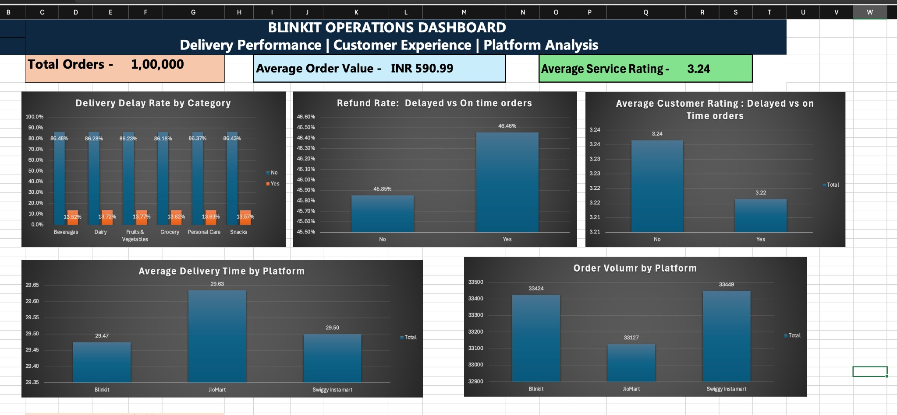

# Delivery Operations & Performance Analysis

## 📌 Overview

Analysis of **100,000 quick-commerce delivery orders** across three platforms (Blinkit, JioMart, Swiggy Instamart) using **PostgreSQL** for querying and **Excel** for the dashboard. The goal was to test whether delivery delays drive refunds and poor customer ratings, and where operational attention should go.

## 🎯 Business Questions

1. What share of orders are delayed, and does it vary by product category?
2. Do delayed orders get refunded more often than on-time orders?
3. Do delayed orders get lower customer service ratings?
4. How do platforms compare on order volume and average delivery time?

## 🗂 Dataset

- **Size:** 100,000 orders
- **Key fields:** category, platform, delivery delay flag, delivery time (minutes), refund flag, service rating, order value
- **Cleaning:** *[Briefly list steps, e.g. null checks, duplicate removal, type conversions.]*

## 📊 Dashboard KPIs

| KPI | Value |
|---|---|
| Total orders | 1,00,000 |
| Average order value | INR 590.99 |
| Average service rating | 3.24 |
| Delay rate (all categories) | ~13.5% to 13.8% |

## 🔍 Key Findings

1. **Delays are evenly spread across categories.** Delay rate ranges from 13.52% (Beverages) to 13.82% (Grocery), a spread of only 0.30 percentage points. No category is a hotspot.
2. **Delays barely affect refunds.** Refund rate is 46.46% for delayed orders vs 45.85% for on-time orders, a gap of 0.61 points.
3. **Delays barely affect ratings.** Average rating is 3.22 for delayed orders vs 3.24 for on-time orders.
4. **Platforms perform almost identically.** Average delivery time is 29.47 min (Blinkit), 29.50 min (Swiggy Instamart) and 29.63 min (JioMart). Order volume is 33,424 (Blinkit), 33,449 (Swiggy Instamart) and 33,127 (JioMart).
5. **Refund rate is high overall (about 46%) regardless of delay.** This suggests refunds are driven by something other than lateness.

## 💡 Recommendations

- **Investigate refund drivers beyond delay.** With ~46% of orders refunded whether late or on time, look at product quality, wrong or missing items, and cancellation reasons.
- **Do not prioritise by category.** Delay rates are flat, so category-specific fixes are unlikely to pay off. Look at time of day, city, store or rider-level data instead.
- **Reduce the baseline delay rate (~13.7%).** Since delays are not tied to category or platform, the cause is likely systemic (dispatch, capacity), not product-specific.
- **Collect richer data.** Add order timestamp, delivery zone, rider ID and refund reason to enable root-cause analysis.

